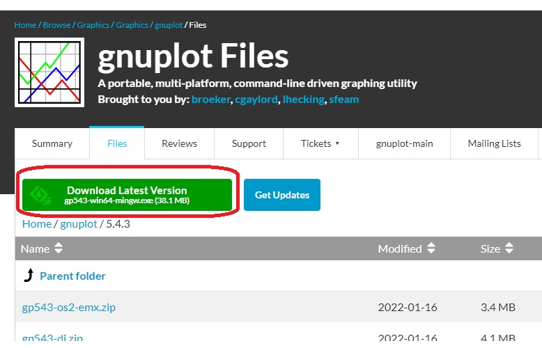
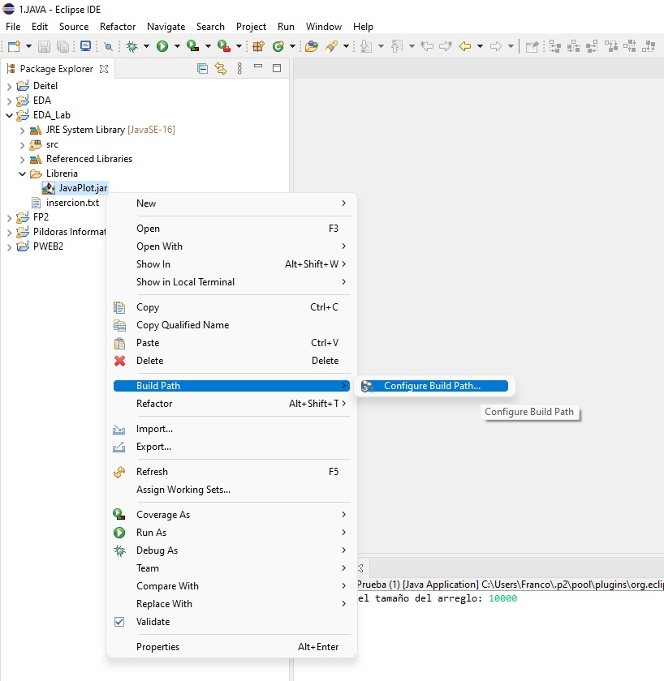
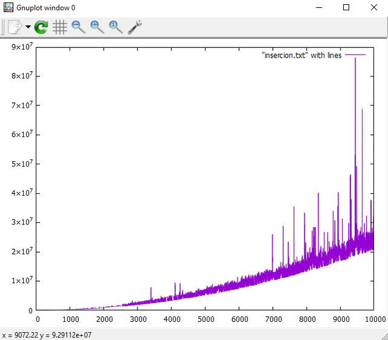
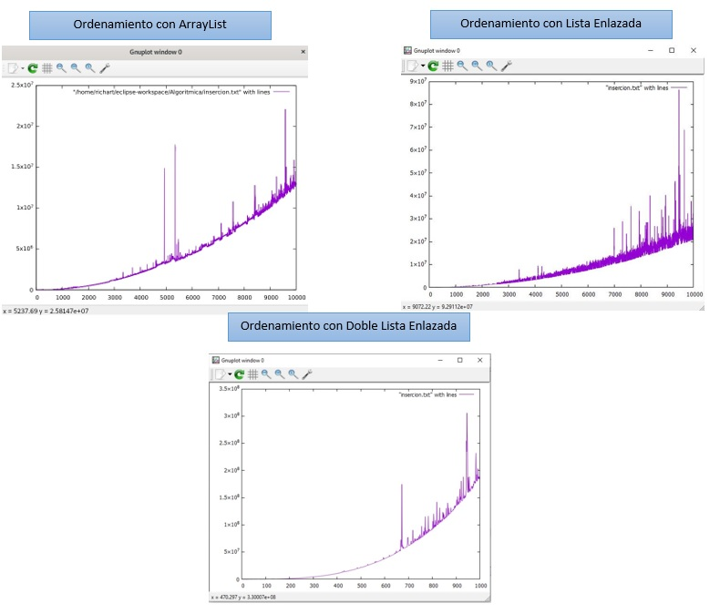

<div align="center">
<table>
    <theader>
        <tr>
            <td></td>
            <th>
                <span style="font-weight:bold;">UNIVERSIDAD NACIONAL DE SAN AGUSTIN</span><br />
                <span style="font-weight:bold;">FACULTAD DE INGENIERÍA DE PRODUCCIÓN Y SERVICIOS</span><br />
                <span style="font-weight:bold;">ESCUELA PROFESIONAL DE INGENIERÍA DE SISTEMAS</span>
            </th>
            <td></td>
        </tr>
    </theader>
    <tbody>
        <tr><td colspan="3"><span style="font-weight:bold;">Formato</span>: Guía de Práctica de Laboratorio / Talleres / Centros de Simulación</td></tr>
        <tr><td><span style="font-weight:bold;">Aprobación</span>:  2022/03/01</td><td><span style="font-weight:bold;">Código</span>: GUIA-PRLE-001</td><td><span style="font-weight:bold;">Página</span>: 1</td></tr>
    </tbody>
</table>
</div>

<div align="center">
<span style="font-weight:bold;">INFORME DE LABORATORIO</span><br />

<table>
<theader>
<tr><th colspan="6">INFORMACIÓN BÁSICA</th></tr>
</theader>
<tbody>
<tr><td>ASIGNATURA:</td><td colspan="5">Estructura de Datos y Algoritmos</td></tr>
<tr><td>TÍTULO DE LA PRÁCTICA:</td><td colspan="5">Sort y Listas Enlazadas</td></tr>
<tr>
<td>NÚMERO DE PRÁCTICA:</td><td>04</td><td>AÑO LECTIVO:</td><td>2022 A</td><td>NRO. SEMESTRE:</td><td>III</td>
</tr>
<tr>
<td>FECHA DE PRESENTACIÓN:</td><td>12/06/2022</td><td>HORA DE PRESENTACIÓN: 11:55 pm</td><td colspan="3"></td>
</tr>
<tr><td colspan="3">INTEGRANTE(s):
<ul>
      <li><a href="https://github.com/fernandocoylaA">Fernando Jesús Coyla Alvarez</a></li>
			<li><a href="https://github.com/Icielo23">Valery Cielo Iquise Mamani</a></li>
			<li><a href="https://github.com/Mario-Chura">Mario Franco Chura Puma</a></li>
</ul>
</td>
<td>NOTA:</td><td colspan="2"></td>
</<tr>
<tr><td colspan="6">DOCENTE(s):
<ul>
<li>Richart Smith Escobedo Quispe - rescobedoq@unsa.edu.pe</li>
</ul>
</td>
</<tr>
</tbody>
</table>
</div>
  

  
<div align="center"><h2> SOLUCIÓN Y RESULTADOS </h2></div>

### I.	SOLUCIÓN DE EJERCICIOS/PROBLEMAS
#
- Antes de empezar con los ejercicios vamos a instalar gnuplot en nuestro sistema operativo ello lo realizamos en el siguiente link https://sourceforge.net/projects/gnuplot/files/gnuplot/5.4.3/
	
	
	
- Luego tenemos que instalar JavaPolot para ello lo descargamos del siguiente link https://sourceforge.net/projects/gnujavaplot/ 
	
	
	
- Ahora en nuestro IDE, en nuestro caso eclipse colocamos nuestro archivo JavaPlot.jar en una carpeta de nuestro proyecto y realizamos la siguiente acción:
	
	
	
- Ahora podemos comenzar con nuestros ejercicios.
 1.  Utilizar el tipo generico de Lista Enlazada para generar los peores casos y ejecutar el algoritmo de ordenamiento
      - Creamos la clase Nodo de tipo generico
      - Creamos la clase Lista de tipo generica
      - Esto lo implementamos en la clase Ejecucion
      - En la clase Ejecucion
       ```py
       //Importamos los paquetes necesarios
       
       import java.io.IOException;
	 import java.io.PrintWriter;
	 import java.util.Scanner;
	 import com.panayotis.gnuplot.JavaPlot; //nuevo paquete JavaPlot para ejecutar en Grafica 
        ```
      - Creamos los metodos generarPeorCaso() 
      ```py
      //En un bucle for asignamos los valores de un nuevo arreglo, con el tamaño ingresado como parametro en la funcion
         for (int i=0; i<t; i++) {
			lista[i] = t-i;		
         }
         return lista;	
      //Retornamos el nuevo arreglo
      ```
      - Y el metodo insertionSort() que recibe un arreglo de enteros
      ```py
      //Dentro del bucle for el valor de la varibale key, para que dentro del bucle while se haga el intercambio
      	for(int j=1; j<A.length; j=j+1) {
			  key = A[j];
			  i = j-1;
			while(i>-1 && A[i]>key) {
			   A[i+1] = A[i];
			   i = i-1;
			}
			  A[i+1] = key;
	          }
	          //..
	          return nano_endTime - nano_startTime;
        //Al final retorna la diferencia del tiempo final con el tiempo de inicio
      ```
      - Luego en la clase Main
       ```py
       //Declaramos una lista enlazada de arrays de enteros
		  Lista<int[]> casos = new Lista<int[]>();
		  
       //En cada array de la lista de enlazada generamos peores casos
		 for(int n=1; n<=tamano; n++) {
			casos.agregar(generarPeorCaso(n));
		 }
		 
       //Obtenemos el tiempo de ordenamiento de cada array de la lista enlazada y lo escribimos en el archivo  "insercion.txt"
		  for (int i = 0; i < casos.getLongitud(); i++) {
			oS.println( String.valueOf( insertionSort(casos.obtener(i)) ) );
		  }
       //Ejecutamos el objeto plot para que cargue el archivo "insercion.txt"
            p.addPlot("\"insercion.txt\" with lines");
	        p.plot();
        ```
        - Mostramos el Resultado
        
		```py
   		Introduzca el tamaño máximo del último arreglo: 10000
		```	
	 - Grafica:
	 
#

 2.  Utilizar el tipo generico de Doble Lista Enlazada para generar los peores casos y ejecutar el algoritmo de ordenamiento.<br>
 
 		- Se creo la clase Nodo.java con los siguientes métodos:
 
 			```py
   					//Constructores
					Node () {}
	
					Node (E data , Node <E> nextNode , Node <E> previousNode){}
	
					Node (E data , Node <E> nextNode) {}
	
					Node (E data) {}

					//Metodos de node
					public void setNext(Node <E> x){}
	
					public Node <E> getPrevious(){}
	
					public Node <E> getNext(){}
	
					public E getData(){}
	
					public void setPrevious(Node <E> x){}
			```


 		- Hacemos extender nuestra clase lista doble enlazada de Comparable para poder modificar nuestro método de ordenamiento se implementaron los siguientes métodos:
	

 	 		```py
					//Atributos
					private Node <E> raiz;
					private Node <E> ultimo;
					public int dimension;

					//Metodo constructor
					public ListaDobleEnlazada(){
					}

					// Metodos
					// Add añade un nuevo elemento
					public void add(E x){
					}

					//Get devuelve el elemento al cual pertenece el indice ingresado
					public Node<E> get(int indice) {
					}
	
					//Remove elimina el elemento al cual pertenece el indice ingresado
					public void remove(int indice) {
					}
	
					//isEmpty nos devuelve un booleano si esta vacio
					public boolean isEmpty(){
					}
	
					public String toString(){
					}
	
					//Metodo de insercion modificado nos devuelve el tiempo de ordenamiento
					public long insertionSort(){
					}
			```


 3.  De los ordenamientos con ArrayList, Lista Enlazada Generica y Doble Lista Enlazada Generica tenemos el siguiente resultado:
 
 
 
   
#

### II.	SOLUCIÓN DEL CUESTIONARIO
#
- ¿Cómo se ejecutaría sus implementaciones desde terminal(consola)? <br>
Respuesta.<br>
	- Creamos un archivo Java, denominado para este caso, prueba.java
	- En el cual implementamos un Objeto de tipo JavaPlot, ademas importamos la extension JavaPlot
	```py
	import com.panayotis.gnuplot.JavaPlot;

	     public class prueba {
   	public static void main(String[] args) {
        	  JavaPlot p = new JavaPlot();
        	  p.addPlot("sin(x),cos(x)");
        	  p.plot();
    	}
	     }
	```
#
- ¿Cómo lo haría desde la terminal? <br>
Respuesta.<br>
	- Luego de esto obtenemos la ruta donde se encuentre el archivo JavaPlot.jar 
	- Para mostrar el resultado del archivo prueba.java en consola ejecutamos
	```py
	javac -cp JavaPlot-0.5.0/dist/JavaPlot.jar prueba.java
	```
	- Luego de esto ejecutamos la siguiente linea de comandos
	```py
	java -cp JavaPlot-0.5.0/dist/JavaPlot.jar:. prueba
	```
	- Con esto ejecutado, se mostrara el resultado del archivo que para este caso son las graficas de las funciones seno y coseno
#

### III.	CONCLUSIONES
#
-El ordenamiento por insercion en el peor de los casos presenta una complejidad de O(n^2) lo cual en el tipo de listas dobles presenta un gran problema que puede llegar a presentar ,en valores mayores 1000, errores por falta de memoria <br>
-El uso de Gnuplot con el paquete JavaPlot, para graficar los tiempos del Algoritmo, nos resulto muy util y practico trabajarlo para dar solucion al laboratorio. Ademas que agregamos el paquete en los IDE de Eclipse y NetBeans, se pudo conocer tambien como se trabaja desde la terminal y pese a algunos comandos no resultaba para no complicado implementarlo.<br>
-Al momento de ejecutar los ordenamientos de las diferentes estructuras de datos se pudo notar la variación de las grafica a pesar de ser los mismos datos, esto se debe a que la velocidad de procesamiento va depender de nuestro equipo, que procesos este realizando en el momento de la ejecución ello hace esa variación en las gráficas. <br>

#
<div align="center"><h2>  RETROALIMENTACIÓN GENERAL </h2></div> <br>

<div align="center"><h2> REFERENCIAS Y BIBLIOGRAFÍA </h2></div> <br>

-   https://stackoverflow.com/questions/49732247/adding-a-project-to-java-build-path-from-terminal
-   https://www.w3schools.com/java/default.asp
-   https://www.youtube.com/watch?v=9q758AJ1nck&ab_channel=latincoder
-   https://www.deltapci.com/java-listas-doblemente-enlazadas/
